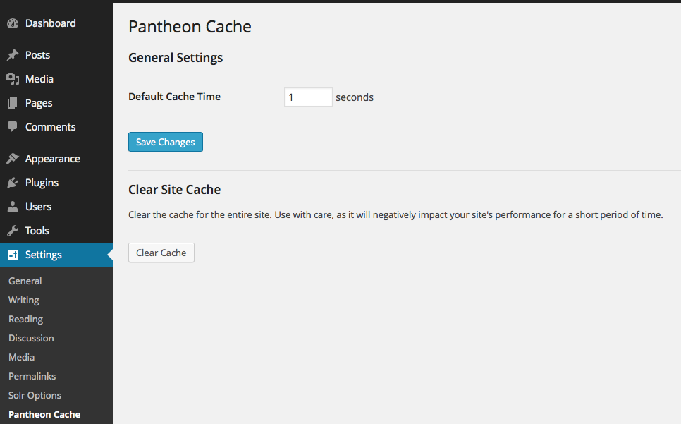
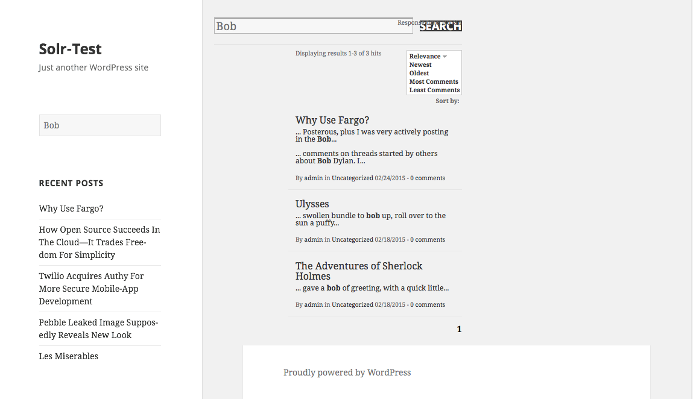

# Solr for WordPress on Pantheon

 * Contributors: pantheon-systems, palepurple, mattweber
 * Author URI: http://pantheon.io
 * Plugin URI: https://github.com/pantheon-systems/solr-for-wordpress-on-pantheon
 * Tags: solr, search, search results, search integration, custom search  
 * Requires at least: 3.0
 * Tested up to: 3.7
 * Stable tag: 1.0

A WordPress plugin for sites hosted on Pantheon that replaces the default WordPress search with Solr.

## Description

A WordPress plugin for sites hosted on Pantheon that replaces the default WordPress search with Solr. 

Features include:

 - Automatic configuration
 - Index pages and posts
 - Enable faceting on fields such as tags, categories, author, and page type.
 - Indexing and faceting on custom fields
 - Multisite support
 - Treat the category facet as a taxonomy
 - Add special template tags so you can create your own custom result pages to match your theme.
 - Completely replaces default WordPress search, just install and configure.
 - Completely integrated into default WordPress theme and search widget.
 - Configuration options allow you to select pages to ignore, features to enable/disable, and what type of result  information you want output.
 - i18n Support
 
Note that this plugin requires you to have an instance of Solr using a schema with the following fields: 

 - id
 - permalink
 - title
 - content
 - numcomments
 - categories
 - categoriessrch
 - tags
 - tagssrch
 - author
 - type
 - text

The facet fields (categories, tags, author, and type) should be string fields.  You can make tagssrch and categoriessrch of any type you want as they are used for general searching.  The plugin is distributed with a Solr schema you can use at `solr-for-wordpress/schema.xml`.

## FAQ 

### Can this plugin be used on sites not hosted on Pantheon
Yes, of course it can, but not out of the box. This pluin picks up the server ip address/host name, port number, and path from environment variables. If you set those variables before you activate the plugin, you will be able to use it without a problem.

### How do I submit my schema?
When the plugin is activated, if everything is properly configured, the schema.xml in the root directory of this plugin is submitted to the server automatically.

## Installation

 1. Upload the `solr-for-wordpress-for-pantheon` folder to the `/wp-content/plugins/` directory
 1. Activate the plugin through the 'Plugins' menu in WordPress
 1. Configure the plugin to your liking on the Settings page.
 1. Load all your posts and/or pages via the "Load All Posts" button in the settings page.

##  Custom Theme Integration 

 1. Create a new theme file called "s4wp_search.php".
 2. Insert your markup, use template methods s4wp_search_form() and s4wp_search_results() to insert the search box and results respectively.
 3. Add result styling to your theme css file, see `solr-for-wordpress-on-pantheon/template/search.css` for an example.
 4. You can use the search widget in your sidebar for search, or use a custom search box that submits the query in the parameter "s".

## Screenshots 

### Configuration Page
 

### Example of results page in default WordPress Theme

## Credits 

 - Dominique Bejean : Custom field support and testing.
 - Eric Pugh : Multi server support.
 - Dustin Rue : Fixes for batch import and multisite.
 - Pale Purple / Filip Zajac : Update to use composer; remove dependency on PHPSolrClient and use Solarium; update schema.xml to work with newer Solr (v4). update indexing logic etc.
 - Pantheon : Updates, patches, filtering all input
